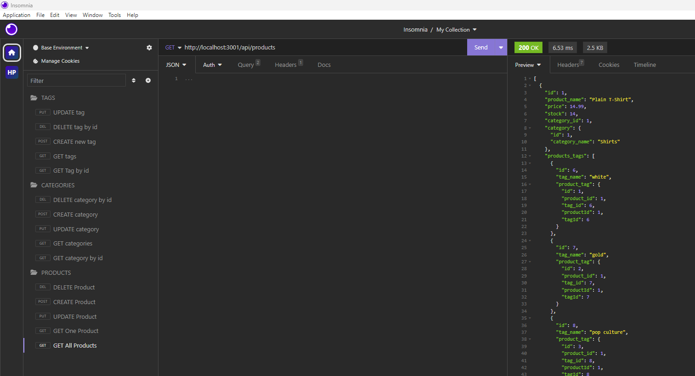

# e-commerce-backend 📝


## Description 📄

A backend solution to run an e-commerce website using Node.js and Express.js. The platform's backbone is made up of this backend architecture, which combines with MySQL2 and Sequelize to manage database activities effectively. I've ensured a smooth and dependable data flow by utilizing the capabilities of these technologies, enabling efficient interactions between users and the program.

I've incorporated the dotenv package with additional security techniques to protect sensitive data, including API keys and database credentials. This strategy strengthens the platform's resistance against possible security breaches. The "e-commerce" database, which has been thoroughly organized with clear tables for goods, categories, and tags, is the system's brain. This company improves data retrieval and manipulation, which improves the user experience overall.

## Table of Contents

* [Installation](#installation) 🛠️
* [Usage](#usage) 📘
* [Contributing](#contributing) 🤝
* [Tests](#tests) 🧪
* [License](#license) 📜
* [Credits](#credits) 🙏
* [Questions](#questions) ❓
* [Deployed Application](#link) 🚀

## <a name="installation"></a>Installation 🛠️

To install the necessary dependencies, run the following command:

```
npm i
npm install dotenv@8.2.0
npm install mysql2@2.2.5
npm install express@4.17.1
npm install sequelize@5.21.7
```

Install DevDependency for developing purposes:
```
nodemon@2.0.3
```

## <a name="usage"></a>Usage 📘

- Install Visual Studio Code to run the application.
- Download MySQL to create a database.
- Install the aforementioned dependencies.
- Use dotenv to create environment variables and secure your database password.
- Install insomnia to create HTTP requests to the server to receive data.

Following is a video demonstrating how to run the application in the terminal. 🎥

[](https://drive.google.com/file/d/10jUaEcrJ4KpqwvfwwWy5nJIL0gdZeDRT/view)

## <a name="contributing"></a>Contribution 🤝

Implement caching mechanisms to store frequently accessed data in memory, reducing database load and improving response times.

Strengthen user authentication and authorization processes. Consider implementing OAuth or JWT for secure authentication and role-based access control to protect sensitive data.

## <a name="tests"></a>Tests 🧪

To run tests, run the following commands:

Open schema.sql in terminal
```
mysql -u root -p
source schema.sql
```

Open server.js in terminal
```
npm i
npm run seed
node server.js
```

## <a name="license"></a>License 📜

This project is licensed under The MIT License. Here is the link to the license to access more information for your reference: [https://opensource.org/licenses/MIT](https://opensource.org/licenses/MIT)

## <a name="credits"></a>Credits 🙏

I utilized the study material provided by the institution as a reference to complete my application.

Following are the documents I used to help me write code:

- [npm documentation on dotenv](https://www.npmjs.com/package/dotenv)
- [Sequelize documentation on model querying basics](https://sequelize.org/master/manual/model-querying-basics.html)
- [Sequelize documentation on validations and constraints](https://sequelize.org/master/manual/validations-and-constraints.html)
- [npm documentation on bcrypt](https://www.npmjs.com/package/bcrypt)
- [Sequelize documentation on associations](https://sequelize.org/master/manual/assocs.html)
- [Sequelize documentation on many-to-many relationships](https://sequelize.org/master/manual/assocs.html#many-to-many-relationships)
- [The Full-Stack Blog guide to deploying with Heroku and MySQL](https://coding-boot-camp.github.io/full-stack/heroku/deploy-with-heroku-and-mysql)


## <a name="questions"></a>Questions ❓

If you have further questions, you are welcome to reach me through my email at hazkeel27@gmail.com.

You can view my projects by going through my GitHub profile at [https://github.com/hazkeel27](https://github.com/hazkeel27).

## <a name="link"></a>Deployed Application 🚀

[https://hazkeel27.github.io/e-commerce-backend/](https://hazkeel27.github.io/e-commerce-backend/)
